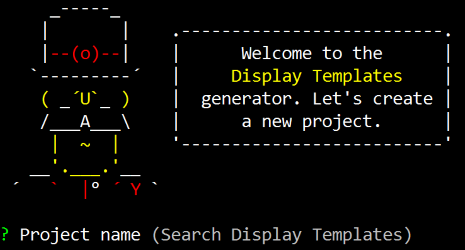

# Yeoman Display Template Generator
Yeoman generator that gives you a kick start for building Search Display Templates.
[](https://nodei.co/npm/generator-displaytemplates/)

# Installation
Run the following command to install the required packages and Yeoman display template generator:

```$ npm install -g gulp yo generator-displaytemplates```

# Update
Execute the following command to update the generator to the latest version:

```$ npm update -g generator-displaytemplates```

# Usage
Once you installed the display templates generator, you can execute this command:

```$ yo displaytemplates```



The generator asks you for the following things:
- **Project name** (default: Search Display Templates)
- **Site URL**
- **Sample files** (default: true): creates sample display templates in a sample folder.
- **Skip install** (default: false): if you set this to true, the ``npm install`` command will be skipped. Be aware, if you do this, it will not install the dependencies.
- **Upload files via SharePoint add-in or client credentials** (choice)
    - SharePoint add-in: this option uses the [gulp-spsync](https://github.com/wictorwilen/gulp-spsync) plugin
    - client credentials: this option uses the [gulp-spsync-creds](https://github.com/estruyf/gulp-spsync-creds) plugin

Depending on the type of upload mechanism you choose, the next questions will vary.

**SharePoint add-in questions**
- **Client ID:** specify the add-in client ID
- **Client Secret**: specify the add-in secret

**Client credentials questions**
- **Username**
- **Password**

# Configuration
The generator has two sub-generators:
1. SharePoint add-in generator
1. Client credentials generator

The reason why is that the SharePoint add-in generator makes use of a Gulp plugin that only works for SharePoint Online sites. The client credentials generator will work both on for SharePoint Online and on-premises.

**SharePoint add-in generator**

The generator for the SharePoint add-in approach makes use of the **gulp-spsync** plugin created by Wictor Wilen. Go to the [gulp-spsync](https://github.com/wictorwilen/gulp-spsync) repo to check out the configuration process that you have to do on your SharePoint Online site.

This generator requires the following things in order to run your gulp tasks afterwards:
- **client_id**: this is the ID of your SharePoint add-in;
- **client_secret**: this is the secret of your SharePoint add-in;
- **site**: this is the site URL where your configured the SharePoint add-in.

**Client credentials generator**

The client credentials generator makes use of the **gulp-spsync-creds** plugin. Go to the [gulp-spsync-creds](https://github.com/estruyf/gulp-spsync-creds) repo for more information about this plugin.

This generator requires the following things in order to run your gulp tasks afterwards:
- **Username**: this is the username for accessing your site;
- **Password**: this is the password for the given username;
- **site**: this is the site URL to where you want to upload the files.

# Development process
Once you completed all previous steps, you can start your development process.

## Display template samples
In the directory you will find a **sample** folder. This contains the following files which can be used to create new templates:
- **control_starter.html**: this is a starter control display template;
- **item_starter.html**: this is a starter item display template;
- **control_minimal.js**: this is a starter control JavaScript display template (this template does not require a HTML file);
- **item_minimal.js**: this is a starter item JavaScript display template (this template does not require a HTML file);

## Display template creation
Create your display templates in the following folder:
```
.
├── src/
│   └── _catalogs/
│       └── masterpage/
│           └── <your-project-name> (default: search-display-templates)/ 
│               └── Create all your files in this folder
```

## Upload, watch, publish
The following Gulp tasks are available:

**gulp**: this task uploads all the display templates to the masterpage gallery
```
$ gulp
```

**gulp set-metadata**: uploads all the files and sets the metadata for the files. Metadata has to be specified in the config.json file and contains sample data.
```
$ gulp set-metadata
```

**gulp set-metadata**: uploads all the files and sets the metadata for the files. Metadata has to be specified in the config.json file and contains sample data.
```
$ gulp set-metadata
```

**gulp publish**: uploads all the files, sets metadata and publishes each of the files.
```
$ gulp publish
```

**gulp watch**: watches for file changes, once a change happens, the file will get uploaded. 
```
$ gulp watch
```

**gulp watch-metadata**: watches for file changes, once a change happens, the file will get uploaded and metadata will get set.
```
$ gulp watch-metadata
```